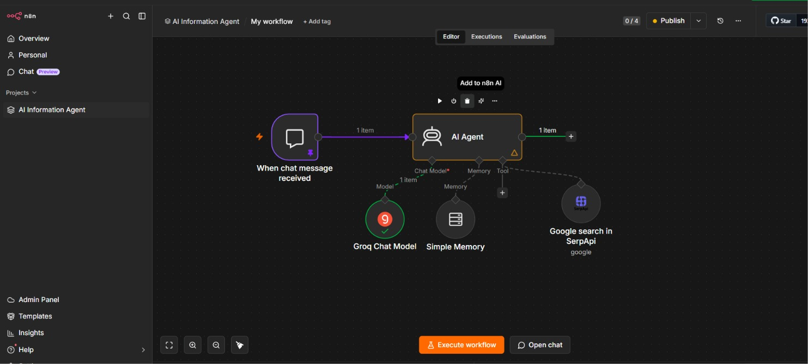
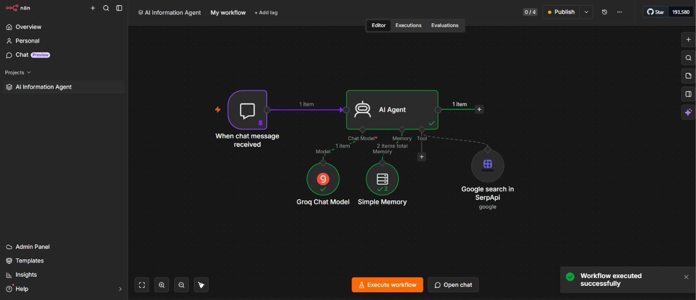
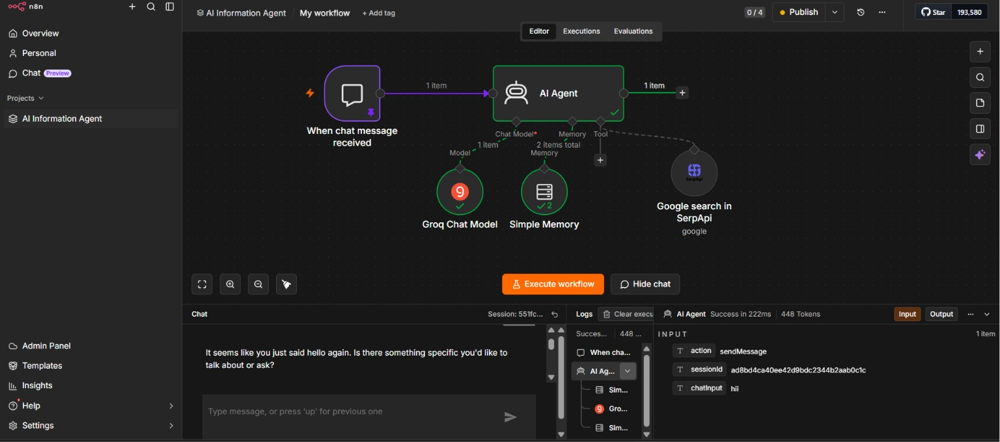

# AI Information Agent (n8n Automation)

## Project Overview
AI Information Agent is an automation workflow built using n8n that provides intelligent information retrieval and response generation. The workflow integrates AI models and external search APIs to fetch, process, and summarize information based on user queries.

## Features
- AI-powered conversational agent
- Real-time information retrieval
- Automated workflow orchestration using n8n
- Context-aware responses with memory support
- Integration with Groq AI models
- Search engine integration through SerpAPI
- Workflow-based automation with minimal coding

## Technologies Used
- n8n
- Groq API
- SerpAPI
- AI Agent Node
- Simple Memory
- Workflow Automation

## Workflow Architecture
1. User submits a query through the chat interface.
2. The AI Agent processes the request.
3. Groq Chat Model generates intelligent responses.
4. SerpAPI retrieves external information when required.
5. Memory node maintains conversation context.
6. Final response is returned to the user.

## Project Screenshots

### Workflow Design

### AI Agent Configuration

### Workflow Execution

## Resume Description
**AI Information Agent (n8n Automation)**

- Built an AI-powered information retrieval agent using n8n workflows.
- Integrated APIs to fetch and summarize real-time data.
- Implemented context-aware response automation.

## Learning Outcomes
- Workflow automation using n8n
- API integration and orchestration
- AI agent development
- Conversational AI implementation
- External tool integration

## Author
Jayaram K.
B.Tech CSM (AI & ML)
GRIET
